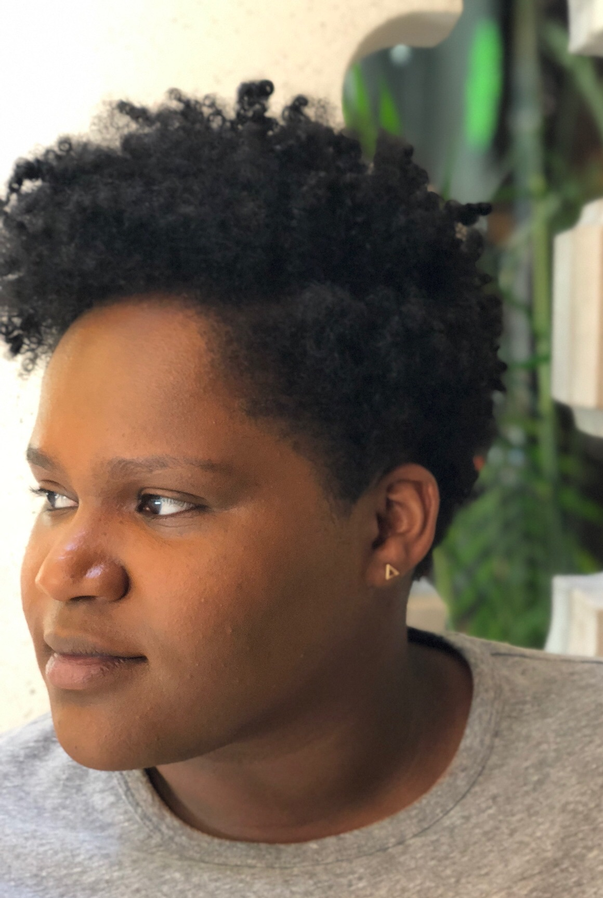

# April J. Harry

Austin, TX

Data Scientist at Rover

Ph.D. in Statistics, Purdue University, Department of Statistics

[LinkedIn](https://www.linkedin.com/in/april-j-harry/)

[Contact me](mailto:harry.april@gmail.com)

## Current Activities
I am currently a Data Scientist at [Rover](http://www.rover.com), where I mainly work on our search ranking algorithm.

I am an alum of the Insight Data Science Fellowship Program, and was previously a Data Scientist at Realself.

## Past Research
My dissertation research involved developing statistical methods for complex, spatially correlated data called mass spectrometry images.  I graduated from Purdue University Statistics in December 2017, having completed my thesis work as a Research Technician in the College of Science at Northeastern University in Boston, MA. My advisor was Prof. Olga Vitek. 

## Education
Ph.D. in Statistics, Purdue University (2017) 

MS in Applied Statistics, Purdue University (2012) 

BS in Mathematics, Xavier University of Louisiana (2010)
