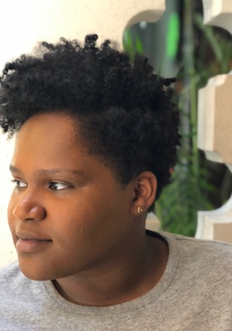

# April J. Harry

Seattle, WA

Data Scientist at Realself

Ph.D. in Statistics, Purdue University, Department of Statistics

[LinkedIn](https://www.linkedin.com/in/april-j-harry/)

[Contact me](mailto:harry.april@gmail.com)

## Current Research and Activities
I am currently working as a Data Scientist at [RealSelf](http://www.realself.com).

I am an alum of the Insight Data Science Fellowship Program in Seattle, WA. My project was sponView, a web app that uses Natural Language Processing techniques to identify sponsored content in YouTube videos.

## Past Research
My dissertation research involved developing statistical methods for complex, spatially correlated data called mass spectrometry images.  I graduated from Purdue University Statistics in December 2017, having completed my thesis work as a Research Technician in the College of Science at Northeastern University in Boston, MA. My advisor was Prof. Olga Vitek. 

## Education
Ph.D. in Statistics, Purdue University (2017) 

MS in Applied Statistics, Purdue University (2012) 

BS in Mathematics, Xavier University of Louisiana (2010)
